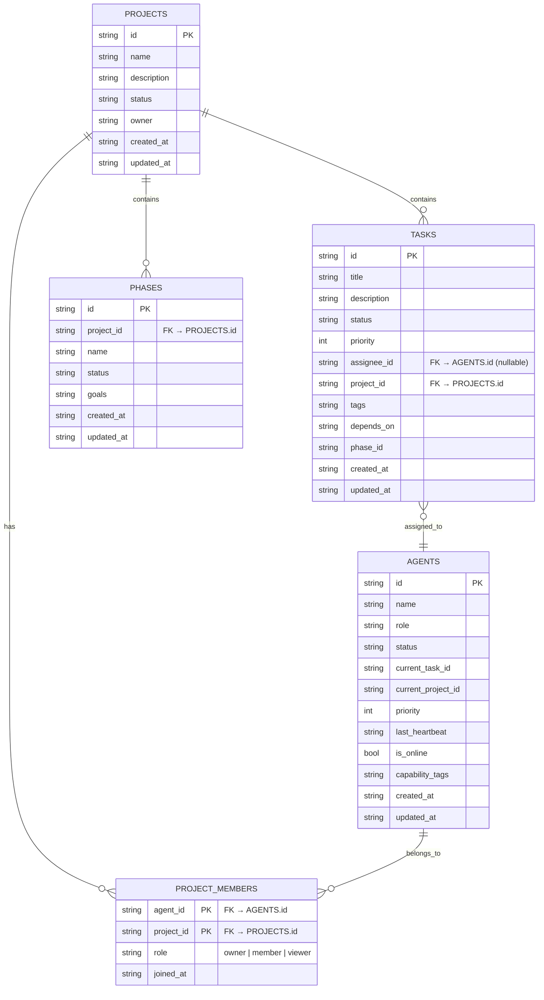

# FoxBoard 多项目支持架构设计

> 设计者：青狐（qing_fox）
> 日期：2026-03-24
> 任务：FB-103
> Phase：Phase 12 — OpenClaw 深度嵌入

---

## 一、现状分析

### 1.1 已有字段

| 表 | 字段 | 说明 |
|----|------|------|
| `tasks` | `project_id` | 任务所属项目（已有，所有任务均挂在 foxboard 下） |
| `agents` | `current_project_id` | Agent 当前所在项目（仅跟踪，非成员关系） |
| `phases` | `project_id` | Phase 所属项目（已有） |

### 1.2 缺失的能力

1. **无成员关系表**：`agents` 与 `projects` 之间是单向追踪，非成员关系
2. **无权限隔离**：无法控制某个 Agent 只能看到特定项目的任务
3. **无跨项目视图**：无法在同一界面看到多个项目的状态
4. **无角色体系**：Agent 在不同项目中可以是 owner/member/viewer，但目前未建模

---

## 二、目标

1. Agent 可以加入多个项目（不同项目可有不同角色）
2. 任务严格按项目隔离（一个任务的可见范围 = 其所属项目）
3. 支持跨项目协作（通过项目间消息/通知）
4. 项目仪盘盘（项目内 Agent 状态、负载、进度）

---

## 三、ER 图



### 角色说明

| 角色 | 权限 |
|------|------|
| `owner` | 管理项目成员、创建/删除任务、项目设置 |
| `member` | 查看、领取、完成自己项目的任务 |
| `viewer` | 只读访问项目（看板、任务详情） |

---

## 四、API 变更清单

### 4.1 新增端点

| # | 方法 | 端点 | 说明 |
|---|------|------|------|
| 1 | GET | `/projects/{project_id}/members` | 获取项目成员列表（含角色） |
| 2 | POST | `/projects/{project_id}/members` | 添加项目成员 `{agent_id, role}` |
| 3 | DELETE | `/projects/{project_id}/members/{agent_id}` | 移除项目成员 |
| 4 | PATCH | `/projects/{project_id}/members/{agent_id}` | 更新成员角色 |
| 5 | GET | `/agents/{agent_id}/projects` | 获取 Agent 参与的所有项目及角色 |
| 6 | GET | `/projects/{project_id}/agents` | 获取项目所有 Agent（含在线状态、当前任务、负载） |

### 4.2 修改端点

| 端点 | 变更 |
|------|------|
| `GET /tasks/kanban` | 增加 `project_id` 参数，不传则返回所有可见项目的任务（需过滤权限） |
| `POST /tasks/` | 创建任务时 project_id 必填，且创建者必须为该项目 member/owner |
| `GET /agents/` | 增加 `project_id` 参数，筛选特定项目的 Agent |
| `POST /tasks/<id>/claim` | 校验 Agent 是否为任务所属项目的 member/owner |

### 4.3 权限隔离规则

```
Agent A 请求 GET /tasks/?project_id=X
  → 检查 PROJECT_MEMBERS 中是否存在 (A, X) 记录
  → 如果不存在返回 403
  → 如果存在返回该项目任务（+ 其 phase/task 数据）
```

---

## 五、前端路由变更

### 5.1 路由结构变化

```
当前（单项目）:
/kanban
/workflow
/agents
/projects      ← 项目列表

新增（多项目）:
/projects/:projectId/kanban     ← 项目看板
/projects/:projectId/workflow   ← 项目流程图
/projects/:projectId/agents     ← 项目成员
/projects/:projectId/phases     ← 项目 Phase 列表

全局视图（需是任意项目 member）:
/dashboard        ← 全局仪表盘（所有项目汇总）
/kanban           ← 当前项目看板（需选中项目）
```

### 5.2 前端改动点

| 页面/组件 | 变更 |
|-----------|------|
| `App.tsx` | 项目选择器全局状态；路由改为 `/projects/:pid/...` 前缀 |
| `Sidebar.tsx` | 显示项目列表 + 当前项目切换下拉 |
| `Kanban.tsx` | 接收 `projectId` 参数；未选项目时显示选择提示 |
| `Projects.tsx` | 改为项目列表 + 成员管理（原有页面升级为项目总览） |
| 新增 `ProjectMembers.tsx` | 项目成员管理面板（owner 可见） |

### 5.3 项目上下文状态

```typescript
// useProject.ts (新增 Context)
interface ProjectContext {
  currentProject: Project | null;
  myRole: 'owner' | 'member' | 'viewer' | null;
  isMember: boolean;
  projects: Project[]; // 我参与的所有项目
}
```

---

## 六、数据库迁移步骤

### Phase 1：仅结构变更（向后兼容）

```sql
-- 新增 project_members 表
CREATE TABLE project_members (
    agent_id   TEXT NOT NULL,
    project_id TEXT NOT NULL,
    role       TEXT NOT NULL DEFAULT 'member'
                CHECK(role IN ('owner', 'member', 'viewer')),
    joined_at  TEXT NOT NULL DEFAULT (datetime('now')),
    PRIMARY KEY (agent_id, project_id),
    FOREIGN KEY (agent_id) REFERENCES agents(id) ON DELETE CASCADE,
    FOREIGN KEY (project_id) REFERENCES projects(id) ON DELETE CASCADE
);

-- 为现有 foxboard 项目初始化所有 Agent 为 owner
INSERT INTO project_members (agent_id, project_id, role)
SELECT id, 'foxboard', 'owner'
FROM agents
WHERE id IN ('qing_fox', 'black_fox', 'white_fox', 'fox_leader');
```

### Phase 2：数据迁移（agents.current_project_id）

```sql
-- agents.current_project_id 作为项目参与状态的辅助参考
-- 保留该字段，仅用于"最近参与项目"的快速提示
-- 不再作为权限判断依据（改用 project_members）
```

### Phase 3：业务逻辑更新（应用层）

- 所有任务/Phase 查询需附带 project_id
- 权限检查：读取 project_members
- 新增 Agent 注册时，自动加入 default 项目（foxboard）作为 owner

---

## 七、迁移风险与回滚

| 风险 | 缓解措施 |
|------|----------|
| 历史任务无 project_id | 默认归属 foxboard；补填逻辑自动为所有 tasks.project_id='foxboard' |
| 现有 API 被破坏 | 渐进式：新增字段不断开旧接口；project_id 参数可选，向下兼容 |
| 权限降级 | 迁移脚本把现有 Agent 全部设为 owner，不影响现有能力 |

---

## 八、实施计划（推荐顺序）

1. **DB Migration** — 创建表 + 初始化 foxboard 成员
2. **后端 API** — 实现 project_members CRUD + 权限检查 middleware
3. **数据回填** — 确保所有 tasks.project_id = 'foxboard'
4. **前端路由** — `/projects/:pid/kanban` 等路由 + 项目切换器
5. **仪表盘升级** — 项目仪盘盘（Agent 负载、进度）
6. **灰度验证** — 单项目（FoxBoard）验证无误后，再考虑多项目

---

## 九、非功能考虑

- **向后兼容**：旧 API（无 project_id 参数）默认使用 foxboard
- **性能**：project_members 为小表（~10条），无需额外索引
- **清理**：agents.current_project_id 字段保留作 UI 显示，不作权限依据
